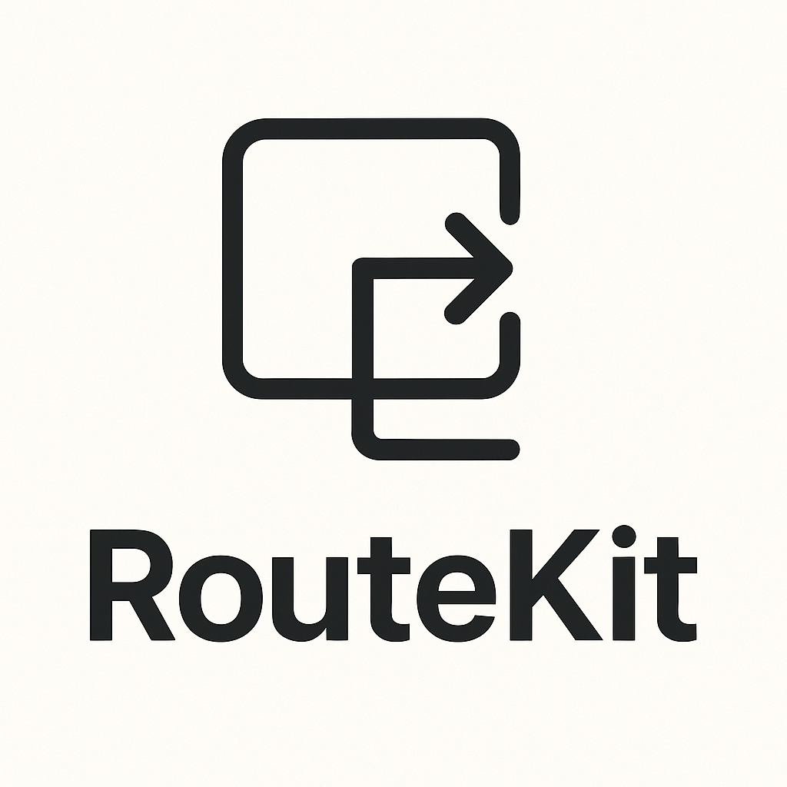

<div align="center">
  
  
  # 🧭 RouteKit
  
  **A powerful, declarative routing library for SwiftUI** <br>
  *Inspired by Flutter's GoRouter*
  
  [](https://swift.org)
  [](https://developer.apple.com/swift/)
  [](LICENSE)
  [](https://swift.org/package-manager/)
  
  <br>
  
  ☕ **[Buy me a coffee](https://buymeacoffee.com/flutterninja9)** if RouteKit helps you build amazing apps!
  
</div>

---

## ✨ Features

RouteKit brings the power and elegance of Flutter's GoRouter to SwiftUI, offering:

🎯 **Declarative Routing** - Define your app's navigation structure with clean, readable code  
🔗 **Deep Linking** - Handle URLs and deep links effortlessly  
🛡️ **Route Guards** - Protect routes with authentication and authorization  
🔄 **Middleware** - Process navigation requests with custom logic  
🏠 **Shell Routes** - Create persistent UI containers (tabs, sidebars, etc.)  
📱 **Stateful Navigation** - Maintain separate navigation stacks per tab  
🎨 **Type-Safe Routing** - Generate type-safe navigation with Swift macros  
⚡ **Nested Routes** - Support for complex navigation hierarchies  
🎭 **Custom Transitions** - Beautiful navigation animations  
🐛 **Error Handling** - Graceful error pages and fallbacks  

---

## 🚀 Quick Start

### Installation

Add RouteKit to your project using Swift Package Manager:

```swift
.package(url: "https://github.com/flutterninja9/RouteKit.git", from: "1.0.0")
```

### Basic Setup

1. **Define your routes:**

```swift
import SwiftUI
import RouteKit

struct ContentView: View {
    @StateObject private var router = RouteKit(
        routes: [
            Route(path: "/") { _ in
                HomeView()
            },
            Route(path: "/about") { _ in
                AboutView()
            },
            Route(path: "/users/:userId") { context in
                UserProfileView(userId: context.pathParameter("userId")!)
            }
        ],
        initialRoute: "/"
    )
    
    var body: some View {
        RouterView(router: router)
    }
}
```

2. **Navigate in your views:**

```swift
struct HomeView: View {
    @Environment(\.routeKit) var router
    
    var body: some View {
        VStack {
            Text("Welcome to RouteKit!")
            
            Button("Go to About") {
                router?.go("/about")
            }
            
            Button("Visit User Profile") {
                router?.go("/users/123")
            }
        }
    }
}
```

---

## 📖 Comprehensive Guide

### 🎯 Basic Navigation

RouteKit provides several navigation methods:

```swift
// Navigate to a route (replaces current route)
router.go("/profile")

// Push a new route onto the stack
router.push("/settings")

// Pop the current route
router.pop()

// Navigate with query parameters
router.go("/search", queryParameters: ["q": "SwiftUI", "category": "tech"])

// Named route navigation
router.goNamed("userProfile", pathParameters: ["userId": "123"])
```

### 🔗 Route Parameters

Extract path and query parameters easily:

```swift
Route(path: "/users/:userId/posts/:postId") { context in
    UserPostView(
        userId: context.pathParameter("userId")!,
        postId: context.pathParameter("postId")!,
        filter: context.queryParameter("filter")
    )
}
```

### 🏠 Shell Routes

Create persistent UI containers that wrap your content:

```swift
let router = RouteKit(
    shellRoutes: [
        ShellRoute { context, child in
            TabView {
                child
                    .tabItem {
                        Image(systemName: "house")
                        Text("Home")
                    }
            }
        } routes: [
            Route(path: "/home") { _ in HomeView() },
            Route(path: "/profile") { _ in ProfileView() }
        ]
    ],
    initialRoute: "/home"
)
```

### 📱 Stateful Shell Routes

Maintain separate navigation stacks for each tab:

```swift
let router = RouteKit(
    statefulShellRoutes: [
        StatefulShellRoute(
            branches: [
                StatefulShellBranch(
                    routes: [
                        Route(path: "/home") { _ in HomeView() },
                        Route(path: "/home/details") { _ in HomeDetailsView() }
                    ]
                ),
                StatefulShellBranch(
                    routes: [
                        Route(path: "/search") { _ in SearchView() },
                        Route(path: "/search/results") { _ in SearchResultsView() }
                    ]
                )
            ]
        ) { context, shell in
            TabView(selection: shell.currentIndexBinding) {
                shell.currentView
                    .tabItem { 
                        Image(systemName: "house")
                        Text("Home") 
                    }
                    .tag(0)
                
                shell.currentView
                    .tabItem { 
                        Image(systemName: "magnifyingglass")
                        Text("Search") 
                    }
                    .tag(1)
            }
        }
    ],
    initialRoute: "/home"
)
```

### 🛡️ Route Guards

Protect your routes with guards:

```swift
// Authentication guard
Route(
    path: "/profile",
    guards: [
        AuthenticationGuard(
            isAuthenticated: { UserSession.shared.isLoggedIn },
            redirectPath: "/login"
        )
    ]
) { _ in
    ProfileView()
}

// Custom authorization guard
struct AdminGuard: RouteGuard {
    let name = "AdminGuard"
    
    func canActivate(context: RouteContext) async -> GuardResult {
        if UserSession.shared.isAdmin {
            return .allow
        } else {
            return .redirect(to: "/access-denied")
        }
    }
}
```

### 🔄 Middleware

Process navigation requests with middleware:

```swift
Route(
    path: "/dashboard",
    middleware: [
        LoggingMiddleware(),
        AnalyticsMiddleware { event, properties in
            Analytics.track(event, properties: properties)
        },
        DataLoadingMiddleware { context in
            let userData = await UserService.loadProfile()
            return ["user": userData]
        }
    ]
) { context in
    DashboardView(userData: context.extra["user"] as? UserData)
}
```

### 🎨 Type-Safe Routing

Use Swift macros for compile-time safety:

```swift
@RoutableEnum
enum AppRoute: CaseIterable {
    case home
    case profile(userId: String)
    case settings
    case about
}

// Usage
AppRoute.profile(userId: "123").navigate(with: router)
AppRoute.settings.push(with: router)
```

```swift
@RouteDefinition("/users/:userId/posts/:postId")
struct UserPostRoute {
    let userId: String
    let postId: String
}

// Usage
Route(UserPostRoute.self) { route in
    UserPostView(userId: route.userId, postId: route.postId)
}
```

### 🎭 Custom Transitions

Add beautiful transitions between routes:

```swift
Route(
    path: "/profile",
    transition: .slide(direction: .leading)
) { _ in
    ProfileView()
}

Route(
    path: "/modal",
    transition: .modal(presentation: .sheet)
) { _ in
    ModalView()
}
```

### 🐛 Error Handling

Handle routing errors gracefully:

```swift
let router = RouteKit(
    routes: routes,
    initialRoute: "/",
    errorBuilder: { error in
        ErrorView(error: error)
    }
)
```

### 🔗 Deep Linking

Handle incoming URLs and deep links:

```swift
struct MyApp: App {
    @StateObject private var router = createRouter()
    
    var body: some Scene {
        WindowGroup {
            RouterView(router: router)
                .onOpenURL { url in
                    router.handleDeepLink(url)
                }
        }
    }
}
```

---

## 📱 Examples

### Basic Navigation Example

```swift
import SwiftUI
import RouteKit

struct BasicNavigationApp: App {
    var body: some Scene {
        WindowGroup {
            RouteKit(initialRoute: "/") {
                Route("/") {
                    HomeView()
                }
                
                Route("/about") {
                    AboutView()
                }
                
                Route("/users/:userId") { context in
                    UserView(userId: context.pathParameter("userId")!)
                }
            }
        }
    }
}
```

### Tab-Based Navigation

```swift
struct TabApp: App {
    var body: some Scene {
        WindowGroup {
            RouteKit(
                shellRoutes: [
                    ShellRoute { context, child in
                        TabView {
                            child
                                .tabItem {
                                    Image(systemName: tabIcon(for: context.fullPath))
                                    Text(tabTitle(for: context.fullPath))
                                }
                        }
                    } routes: [
                        Route("/home") { HomeTabView() },
                        Route("/search") { SearchTabView() },
                        Route("/profile") { ProfileTabView() }
                    ]
                ],
                initialRoute: "/home"
            )
        }
    }
}
```

### Authentication Flow

```swift
struct AuthApp: App {
    var body: some Scene {
        WindowGroup {
            RouteKit(initialRoute: "/") {
                Route("/login") {
                    LoginView()
                }
                
                Route("/") {
                    SplashView()
                }
                
                Route(
                    "/dashboard",
                    guards: [
                        AuthenticationGuard(
                            isAuthenticated: { AuthService.isLoggedIn },
                            redirectPath: "/login"
                        )
                    ]
                ) {
                    DashboardView()
                }
                
                Route(
                    "/admin",
                    guards: [
                        AuthenticationGuard(
                            isAuthenticated: { AuthService.isLoggedIn },
                            redirectPath: "/login"
                        ),
                        AuthorizationGuard(
                            hasPermission: { _ in AuthService.isAdmin },
                            deniedPath: "/access-denied"
                        )
                    ]
                ) {
                    AdminView()
                }
            }
        }
    }
}
```

---

## 🛠️ Advanced Configuration

### Custom Router Configuration

```swift
let router = RouteKit(
    routes: routes,
    shellRoutes: shellRoutes,
    statefulShellRoutes: statefulShellRoutes,
    initialRoute: "/",
    errorBuilder: { error in
        CustomErrorView(error: error)
    },
    redirect: { context in
        // Global redirect logic
        if !UserService.isOnboarded && context.fullPath != "/onboarding" {
            return "/onboarding"
        }
        return nil
    },
    debugLogDiagnostics: true
)
```

### Programmatic Navigation

```swift
class NavigationService: ObservableObject {
    private var router: RouteKit?
    
    func setRouter(_ router: RouteKit) {
        self.router = router
    }
    
    func navigateToProfile(userId: String) {
        router?.go("/profile/\(userId)")
    }
    
    func showModal<Content: View>(@ViewBuilder content: () -> Content) {
        router?.presentModal {
            content()
        }
    }
}
```

---

## 📝 Requirements

- **iOS 15.0+** / **macOS 12.0+** / **watchOS 8.0+** / **tvOS 15.0+**
- **Swift 6.1+**
- **Xcode 15.0+**

---

### Development Setup

1. Clone the repository
2. Open `Package.swift` in Xcode
3. Run tests with `⌘+U`
4. Submit a Pull Request

### Areas for Contribution

- 🐛 Bug fixes and improvements
- 📚 Documentation and examples
- ✨ New features and enhancements
- 🧪 Additional test coverage
- 🎨 UI/UX improvements

---

## 📄 License

RouteKit is released under the MIT License. See [LICENSE](LICENSE) for details.

---

## 🙏 Acknowledgments

- Inspired by [Flutter's GoRouter](https://pub.dev/packages/go_router)
- Built with ❤️ for the SwiftUI community
- Special thanks to all [contributors](https://github.com/flutterninja9/RouteKit/graphs/contributors)

---

## 📞 Support & Community

- 🐛 **Issues**: [GitHub Issues](https://github.com/flutterninja9/RouteKit/issues)
- 💬 **Discussions**: [GitHub Discussions](https://github.com/flutterninja9/RouteKit/discussions)
- 📧 **Email**: [your-email@example.com](mailto:anirudh.singh91402@gmail.com)
- 🐦 **Twitter**: [@flutterninja9](https://twitter.com/flutterninja9)

---

<div align="center">
  
  **Made with ❤️ by [flutterninja9](https://github.com/flutterninja9)**
  
  ⭐ **Star this repo if RouteKit helped you!** ⭐
  
  ☕ **[Buy me a coffee](https://buymeacoffee.com/flutterninja9)** ☕
  
</div>